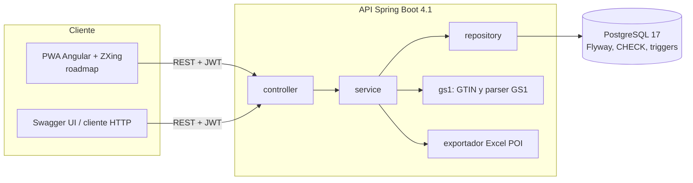
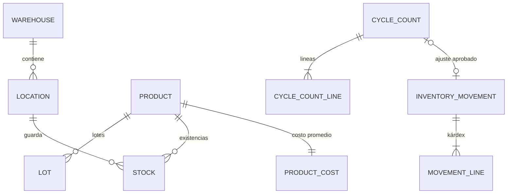

# inventario-multibodega

WMS multibodega para pymes ecuatorianas: kárdex valorizado con costo promedio ponderado (NIC 2), lotes con vencimiento y despacho FEFO, transferencias atómicas entre bodegas, conteo cíclico aprobado y auditado, y lectura de códigos GS1 / QR.


   

**Estado:** API REST completa y probada (89 tests, cobertura de la lógica de negocio 85 %). La PWA en Angular con cámara, la imagen Docker de la API y el despliegue están en el [roadmap](#roadmap).

**Demo:** pendiente de despliegue (Render + Neon). **Usuarios de demo** (se crean con `APP_DEMO_ENABLED=true`): `supervisor@demo.local`, `operador@demo.local` y `auditor@demo.local`, con la contraseña que definas en `DEMO_PASSWORD`.

## Problema que resuelve
En una pyme con varias bodegas el inventario suele vivir en hojas de cálculo: el kárdex no cuadra con lo que hay en percha, nadie sabe qué lote vence primero y los ajustes se hacen sin control. Este sistema registra cada movimiento en un kárdex inmutable valorizado según NIC 2 (obligatoria en Ecuador por resolución de la Supercias), impide el stock negativo incluso con varios usuarios a la vez y convierte el conteo físico en un proceso con aprobación y bitácora.

## Funcionalidades
- **Kárdex valorizado** con costo promedio ponderado móvil (NIC 2 párr. 25–27; LIFO no permitido), saldos por producto y por bodega, filtros por fecha y **exportación a Excel** (Apache POI, streaming).
- **Movimientos**: ingreso, egreso, transferencia y ajuste, siempre con documento de referencia (catálogo con códigos del SRI).
- **Nunca stock negativo**: validación en el servicio + `CHECK (quantity >= 0)` en PostgreSQL.
- **Transferencias entre bodegas en una sola transacción**: si un renglón falla, no se aplica nada.
- **Concurrencia segura** con `@Version` y reintentos automáticos; demostrado con tests de 16 hilos reales.
- **Lotes y vencimientos**: despacho FEFO automático, bloqueo de lotes vencidos, alertas de lotes por vencer y de stock mínimo por bodega.
- **Unidades con conversiones** (UNECE Rec. 20): una caja puede tener su propio GTIN-14.
- **Escaneo**: GTIN-8/12/13/14 con dígito verificador GS1, cadenas GS1-128/DataMatrix/QR con lote y vencimiento, GS1 Digital Link y QR internos de ubicación.
- **Conteo cíclico ciego** con diferencias valorizadas, aprobación por un supervisor distinto de quien contó (segregación de funciones) y ajuste enlazado al conteo.
- **Conciliación** kárdex = stock = valorización, expuesta como reporte y verificada en los tests.
- **Bitácora de auditoría** inmutable (trigger de solo inserción).

## Arquitectura


Flujo de un movimiento: `MovementService` (reintento ante conflicto de `@Version`) → `MovementPostingService` (una transacción: stock por ubicación y lote, costo promedio y renglones del kárdex) → auditoría en la misma transacción.

## Stack y por qué
| Capa | Tecnología | Motivo |
|---|---|---|
| Backend | Java 25 + Spring Boot 4.1.1 | Versión estable con soporte OSS (la rama 3.5 terminó su soporte el 30-jun-2026). `@Retryable` nativo de Spring Framework 7. |
| Persistencia | Spring Data JPA (Hibernate 7) + Flyway | Bloqueo optimista con `@Version`; esquema versionado y validado al arrancar. |
| Base de datos | PostgreSQL 17 | `UNIQUE NULLS NOT DISTINCT`, `CHECK`, triggers y vista de conciliación; misma versión en local, tests y Neon. |
| Seguridad | Spring Security + JWT HS256 (Nimbus) + BCrypt + Bucket4j | Deny-by-default, tokens cortos, rate limiting del login. |
| Excel | Apache POI 5.5.1 (SXSSF) | Exportación en streaming con pocas filas en memoria. |
| Documentación | springdoc-openapi 3.1.1 | Swagger UI generado desde el código. |
| Tests | JUnit 5, Mockito, Testcontainers 2 (PostgreSQL real), JaCoCo | Integración contra la misma base de datos de producción. |
| DevOps | GitHub Actions, gitleaks, Dependabot | CI con escaneo de secretos, build, tests y cobertura. |

## Modelo de datos
Ver [docs/modelo-datos.md](docs/modelo-datos.md) (diagrama ER y diccionario), derivado de las fuentes en [docs/investigacion.md](docs/investigacion.md).



## Ejecutar en local
Requisitos: JDK 25 o superior y Docker (para PostgreSQL y los tests).

```bash
cp .env.example .env              # completa DB_PASSWORD, JWT_SECRET y, si quieres demo, DEMO_PASSWORD
docker compose up -d db           # PostgreSQL 17 en 127.0.0.1:5432
cd backend
set -a && . ../.env && set +a     # carga las variables en la sesión (Git Bash / Linux / macOS)
./mvnw spring-boot:run
```

API en `http://localhost:8080`, Swagger en `http://localhost:8080/swagger-ui.html`. Con `APP_DEMO_ENABLED=true` se cargan 3 bodegas, 10 productos con GTIN de prefijo GS1 952 (reservado para demostraciones), 60 días de movimientos y un conteo pendiente de aprobación. Ejemplos listos en [docs/api/inventario.http](docs/api/inventario.http).

Sin Docker: usa cualquier PostgreSQL 17 y apunta `DB_URL` a él.

## Variables de entorno
| Variable | Descripción | Obligatoria |
|---|---|---|
| `DB_URL` | URL JDBC de PostgreSQL | Sí |
| `DB_USER` / `DB_PASSWORD` | Credenciales de la base de datos | Sí |
| `JWT_SECRET` | Secreto HS256 en Base64 (≥ 32 bytes). `openssl rand -base64 48` | Sí |
| `JWT_TTL` | Vida del token (ISO-8601, por defecto `PT30M`) | No |
| `CORS_ALLOWED_ORIGINS` | Orígenes permitidos separados por coma (sin `*`) | No |
| `LOGIN_ATTEMPTS_PER_MINUTE` | Intentos de login por IP y por correo | No |
| `ADMIN_EMAIL` / `ADMIN_PASSWORD` | Primer administrador (contraseña de 12+ caracteres) | No |
| `APP_DEMO_ENABLED` / `DEMO_PASSWORD` | Datos ficticios de demostración | No |
| `APP_SWAGGER_ENABLED` | Publica Swagger UI y `/v3/api-docs` | No |
| `APP_TIME_ZONE` | Zona para fechas y vencimientos (`America/Guayaquil`) | No |

## API
Swagger: `http://localhost:8080/swagger-ui.html`

| Método | Ruta | Descripción | Rol |
|---|---|---|---|
| POST | `/api/auth/login` | Login, devuelve JWT | Público |
| GET | `/api/products` · `/api/products/{id}/lots` | Catálogo y lotes | Autenticado |
| POST | `/api/movements/receipts` | Ingreso (recalcula el promedio) | Operador+ |
| POST | `/api/movements/issues` | Egreso (FEFO si no se indica lote) | Operador+ |
| POST | `/api/movements/transfers` | Transferencia atómica entre bodegas | Operador+ |
| POST | `/api/movements/adjustments` | Ajuste con motivo | Supervisor+ |
| GET | `/api/kardex` · `/api/kardex/export` | Kárdex valorizado y Excel | Autenticado |
| POST | `/api/scan` | Interpreta GTIN, GS1, Digital Link, QR de ubicación o SKU | Autenticado |
| GET | `/api/alerts/low-stock` · `/api/alerts/expiring-lots` | Alertas | Autenticado |
| POST | `/api/cycle-counts` → `/lines/{id}` → `/submit` → `/approve` | Conteo cíclico | Operador+ / Supervisor+ aprueba |
| GET | `/api/reports/reconciliation` · `/api/reports/dashboard` | Conciliación y resumen | Autenticado |
| GET | `/api/audit-log` | Bitácora | Admin, Auditor |

Los errores siguen RFC 9457 (`application/problem+json`) con un `code` estable, por ejemplo `INSUFFICIENT_STOCK`, `LOT_EXPIRED`, `WAREHOUSE_FORBIDDEN` o `SEGREGATION_OF_DUTIES`.

## Tests y cobertura
```bash
cd backend
./mvnw verify   # 89 tests: unitarios + integración con PostgreSQL real (Testcontainers) + JaCoCo
```
- **Concurrencia**: 16 egresos simultáneos sobre 10 unidades nunca venden de más; recepciones simultáneas mantienen el promedio exacto; transferencias cruzadas no crean ni destruyen stock; y un test demuestra que `@Version` rechaza una actualización perdida.
- **El kárdex cuadra con el stock**: cada escenario de integración termina verificando la conciliación.
- **Base de datos como última barrera**: stock negativo, kárdex y bitácora inmutables, stock en ubicación de otra bodega y segregación de funciones son rechazados por PostgreSQL aunque se use SQL directo.
- Cobertura de líneas: **85 %** en la lógica de negocio (`service`, `gs1`, `entity`); el build falla por debajo de 70 %.

## Despliegue (gratis)
Planificado: API en **Render** (servicio web gratis; duerme tras 15 min sin tráfico, 750 h/mes), base de datos en **Neon** (0,5 GB, PostgreSQL 17) y PWA en **Vercel** (plan Hobby, uso no comercial). Ver [roadmap](#roadmap).

## Seguridad aplicada
- Secretos solo por variables de entorno; sin valores por defecto: si falta `JWT_SECRET` o la base de datos, la API no arranca. `.env` no se versiona y gitleaks revisa cada push.
- Spring Security **deny-by-default**; públicos solo login, health y OpenAPI. CORS con orígenes explícitos (se rechaza `*`).
- JWT HS256 de 30 min con emisor validado; BCrypt; **rate limiting** del login por IP y correo (caché acotada); respuesta de login genérica y comparación contra un hash ficticio para no filtrar qué correos existen.
- Autorización por rol (**API5**) y por bodega (**API1 BOLA**): un operador solo opera en sus bodegas.
- Bean Validation en todos los DTO; paginación y exportación con límites (**API4**); SQL solo parametrizado.
- Errores RFC 9457 sin stack traces ni detalles de la base de datos; Actuator solo `health`.
- Cabeceras: CSP `default-src 'none'`, `X-Frame-Options: DENY`, `nosniff`, `Referrer-Policy: no-referrer`.
- Kárdex y bitácora **append-only** con triggers; segregación de funciones reforzada con un `CHECK` en la tabla de conteos.
- LOPDP: de los usuarios solo se guarda correo, nombre y rol; los datos de demostración son ficticios.

## Decisiones técnicas
- **Costo promedio móvil y no FIFO**: ambos son válidos según NIC 2; el promedio recalculado en cada ingreso (párr. 27) es más simple de auditar y no obliga a rastrear capas de costo. LIFO está prohibido y no se ofrece.
- **Un costo por producto para toda la empresa**: NIC 2 párr. 26 dice que la ubicación geográfica no justifica otra fórmula; así una transferencia entre bodegas no altera el costo.
- **Bloqueo optimista + reintento** en lugar de `SELECT … FOR UPDATE`: no se bloquea a nadie en lecturas y los conflictos, raros en la práctica, se resuelven solos. El costo del producto se lee antes que el stock para que cualquier lectura desfasada termine en conflicto de versión y no en un falso descuadre.
- **La hora del movimiento la fija el servidor dentro de la transacción**; el orden del kárdex es el orden de registro.
- **Kárdex inmutable**: se corrige con nuevos movimientos, nunca editando; lo garantiza la base de datos.
- **Spring Boot 4.1 en lugar de 3.x**: la rama 3.5 quedó sin parches OSS; usarla contradice OWASP A03:2025 (cadena de suministro).
- **Datos demo creados con los servicios reales**, no con SQL: el kárdex de la demo cuadra por construcción.

## Roadmap
- [ ] PWA en Angular 22 con lector de cámara (`@zxing/browser`), etiquetas QR de ubicaciones y modo sin conexión.
- [ ] Dockerfile multi-stage de la API (usuario no root, healthcheck) y `docker compose up --build` con API + PWA.
- [ ] Despliegue en Render + Neon + Vercel, capturas y GIF de la demo.
- [ ] Test e2e con Playwright del flujo de conteo cíclico.
- [ ] Deterioro al valor neto realizable (NIC 2 párr. 9) y prorrateo de costos de importación.
- [ ] Programación automática de conteos por clase ABC.

## Fuentes de datos y licencias
- Todos los datos de demostración son **ficticios**; los GTIN usan el prefijo GS1 **952**, reservado para ejemplos.
- Normas y fuentes citadas (NIC 2, GS1, ISO/IEC 18004, OMS, SRI, UNECE, OWASP, LOPDP): ver [docs/investigacion.md](docs/investigacion.md).
- Código bajo licencia [MIT](LICENSE).

## Autor
**Diego Francisco Granda Zhingre** · [GitHub](https://github.com/DiegoFranciscoG)
