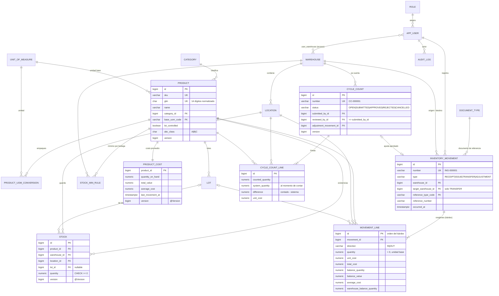

# Modelo de datos

Derivado de las reglas `R-xx` de [investigacion.md](investigacion.md). Motor: **PostgreSQL 17**. Migraciones versionadas con
**Flyway** en `backend/src/main/resources/db/migration`. Los nombres de tablas y columnas están en inglés; los catálogos y datos
de demostración, en español.

## Diagrama entidad-relación

## Diccionario de datos

### Seguridad y usuarios

| Tabla | Campo | Tipo | Restricción | Regla / fuente |
|---|---|---|---|---|
| role | code | varchar(20) | PK: `ADMIN`, `SUPERVISOR`, `OPERATOR`, `AUDITOR` | R-21, R-25 |
| role | name, description | varchar | NOT NULL (name) | |
| app_user | id | bigint identity | PK | |
| app_user | email | varchar(254) | UNIQUE, `CHECK (email = lower(email))` | R-25 (minimización LOPDP) |
| app_user | full_name | varchar(120) | NOT NULL | R-25 |
| app_user | password_hash | varchar(100) | NOT NULL, BCrypt | OWASP A04/A07 |
| app_user | role_code | varchar(20) | FK → role | R-25 |
| app_user | active, created_at, version | boolean, timestamptz, bigint | NOT NULL | |
| user_warehouse | user_id, warehouse_id | bigint | PK compuesta, FK | R-25 (BOLA) |

### Catálogo

| Tabla | Campo | Tipo | Restricción | Regla / fuente |
|---|---|---|---|---|
| category | code | varchar(20) | UNIQUE | |
| category | name | varchar(80) | NOT NULL | |
| unit_of_measure | code | varchar(3) | PK (UNECE Rec. 20/21) | R-23 |
| unit_of_measure | name | varchar(40) | NOT NULL | R-23 |
| product | sku | varchar(40) | UNIQUE, `^[A-Z0-9][A-Z0-9._-]{1,39}$` | |
| product | gtin | char(14) | UNIQUE nullable, `^[0-9]{14}$` + dígito verificador validado en el servicio | R-11 |
| product | name / description | varchar(150) / varchar(500) | NOT NULL / NULL | |
| product | category_id | bigint | FK → category | |
| product | base_uom_code | varchar(3) | FK → unit_of_measure | R-23 |
| product | lot_controlled | boolean | NOT NULL | R-13 |
| product | abc_class | char(1) | `CHECK IN ('A','B','C')` | R-20 |
| product | active, created_at, version | | NOT NULL | |
| product_uom_conversion | product_id, uom_code | bigint, varchar(3) | UNIQUE (product_id, uom_code) | R-12 |
| product_uom_conversion | factor | numeric(18,6) | `CHECK > 0` (unidades base por empaque) | R-12 |
| product_uom_conversion | gtin | char(14) | UNIQUE nullable (GTIN-14 del empaque) | R-11, R-12 |

### Almacenaje

| Tabla | Campo | Tipo | Restricción | Regla / fuente |
|---|---|---|---|---|
| warehouse | code | varchar(10) | UNIQUE, `^[A-Z0-9-]{2,10}$` | R-17 |
| warehouse | name, city, address | varchar | name NOT NULL | datos ficticios |
| location | warehouse_id | bigint | FK → warehouse | R-17 |
| location | aisle, rack, level | varchar(3) | NOT NULL (pasillo, estante, nivel) | R-17 |
| location | code | varchar(20) | UNIQUE (warehouse_id, code), formato `P01-E02-N3` | R-17 |
| location | type | varchar(12) | `RECEIVING`, `STORAGE`, `SHIPPING`, `QUARANTINE` | R-17 |
| location | (id, warehouse_id) | | UNIQUE → destino de FK compuesta desde stock y kárdex | integridad |
| lot | product_id, lot_number | bigint, varchar(20) | UNIQUE (product_id, lot_number); `^[A-Za-z0-9._/-]{1,20}$` | R-13 |
| lot | expiry_date, production_date | date | `production_date <= expiry_date` | R-13, R-18 |
| stock | product_id, warehouse_id, location_id, lot_id | bigint | FK (location_id, warehouse_id) → location; FK (lot_id, product_id) → lot; `UNIQUE NULLS NOT DISTINCT (product_id, location_id, lot_id)` | R-07, R-17 |
| stock | quantity | numeric(18,4) | `CHECK (quantity >= 0)` | **R-07** |
| stock | version | bigint | `@Version` | **R-10** |
| stock_min_rule | product_id, warehouse_id | bigint | UNIQUE | R-19 |
| stock_min_rule | min_quantity | numeric(18,4) | `CHECK >= 0` | R-19 |

### Operación y costo

| Tabla | Campo | Tipo | Restricción | Regla / fuente |
|---|---|---|---|---|
| product_cost | product_id | bigint | PK, FK → product | R-03 |
| product_cost | quantity_on_hand | numeric(18,4) | `CHECK >= 0` | R-09 |
| product_cost | total_value | numeric(20,4) | `CHECK >= 0` | R-02 |
| product_cost | average_cost | numeric(20,6) | `CHECK >= 0` | R-01, R-02 |
| product_cost | last_movement_at | timestamptz | | R-24 |
| product_cost | version | bigint | `@Version` | **R-10** |
| document_type | code | varchar(4) | PK: `01, 03, 04, 05, 06` (SRI) + `OC, PED, OT, AJ, CC, SI` (internos) | R-22 |
| document_type | source | varchar(8) | `SRI` o `INTERNAL` | R-22 |
| inventory_movement | number | varchar(20) | UNIQUE (`ING-`, `EGR-`, `TRF-`, `AJU-` + secuencia) | R-06 |
| inventory_movement | type | varchar(12) | `RECEIPT`, `ISSUE`, `TRANSFER`, `ADJUSTMENT` | R-06 |
| inventory_movement | warehouse_id / target_warehouse_id | bigint | `CHECK ((type = 'TRANSFER') = (target_warehouse_id IS NOT NULL))` | R-08 |
| inventory_movement | reference_type_code, reference_number | varchar | NOT NULL | R-22 |
| inventory_movement | occurred_at, created_by_id, cycle_count_id | | NOT NULL (salvo cycle_count_id) | R-21, R-24 |
| movement_line | id | bigint identity | orden cronológico del kárdex | R-06 |
| movement_line | direction | varchar(3) | `IN` / `OUT` | R-06 |
| movement_line | quantity | numeric(18,4) | `CHECK > 0` (unidad base) | R-12 |
| movement_line | uom_code, uom_quantity | | cantidad tal como se digitó | R-12 |
| movement_line | unit_cost, total_cost | numeric(20,6), numeric(20,4) | `CHECK >= 0` | R-02, R-04 |
| movement_line | balance_quantity, balance_value, average_cost | numeric | saldos del producto después del renglón | R-06, R-09 |
| movement_line | warehouse_balance_quantity | numeric(18,4) | saldo de la bodega después del renglón | R-09 |
| movement_line / inventory_movement | — | trigger | **append-only**: `UPDATE`/`DELETE` lanzan excepción | R-06 |

### Conteo cíclico y auditoría

| Tabla | Campo | Tipo | Restricción | Regla / fuente |
|---|---|---|---|---|
| cycle_count | number | varchar(20) | UNIQUE (`CC-000001`) | R-20 |
| cycle_count | warehouse_id, aisle_filter, abc_filter | | filtros opcionales | R-20 |
| cycle_count | status | varchar(12) | `OPEN → SUBMITTED → APPROVED/REJECTED`, o `CANCELLED` | R-20, R-21 |
| cycle_count | submitted_by_id, reviewed_by_id | bigint | `CHECK (reviewed_by_id <> submitted_by_id)` | **R-21 (COSO)** |
| cycle_count | adjustment_movement_id | bigint | FK → inventory_movement | R-21 |
| cycle_count | version | bigint | `@Version` (evita doble aprobación) | R-10 |
| cycle_count_line | location_id, product_id, lot_id | bigint | `UNIQUE NULLS NOT DISTINCT` por conteo | R-20 |
| cycle_count_line | counted_quantity | numeric(18,4) | `CHECK >= 0` | R-20 |
| cycle_count_line | system_quantity, difference, unit_cost | numeric | se fijan al contar (el contador no los ve) | R-20 |
| audit_log | occurred_at, actor_email, action, entity_type, entity_id, details (jsonb) | | append-only (trigger) | R-21, OWASP A09 |

### Vista de conciliación (R-09)

`v_stock_reconciliation` compara, por producto: Σ `stock.quantity`, `product_cost.quantity_on_hand`, Σ(IN) − Σ(OUT) de
`movement_line` y el `balance_quantity` del último renglón del kárdex. Si las cuatro cifras no coinciden, el producto aparece
como descuadrado en `/api/reports/reconciliation`.

## Algoritmo de costo promedio (R-01 a R-04)

| Evento | Cantidad | Valor | Promedio |
|---|---|---|---|
| Ingreso `q` a costo `c` | `Q + q` | `V + q·c` | `(V + q·c) / (Q + q)` |
| Egreso / ajuste negativo `q` | `Q − q` | `V − q·p` (si `Q − q = 0`, valor = 0) | `p` (no cambia) |
| Transferencia `q` | salida y entrada en la misma transacción | sin cambio neto | sin cambio |
| Ajuste positivo `q` | `Q + q` | `V + q·p` (si no había stock, costo indicado por el supervisor) | se recalcula |

Precisión: cantidades `numeric(18,4)`, valores `numeric(20,4)`, costo unitario `numeric(20,6)`, redondeo `HALF_UP`.

## Datos de ejemplo

Los datos de demostración no están en las migraciones: los crea `DemoDataSeeder` al arrancar con `APP_DEMO_ENABLED=true`
**usando los mismos servicios de negocio** (así el kárdex y el costo de la demo cuadran por construcción). Son ficticios:
3 bodegas (Quito, Guayaquil, Cuenca), productos con GTIN de prefijo 952 (R-15), lotes con vencimientos próximos y vencidos,
y usuarios `@demo.local` sin datos personales reales (R-25).
